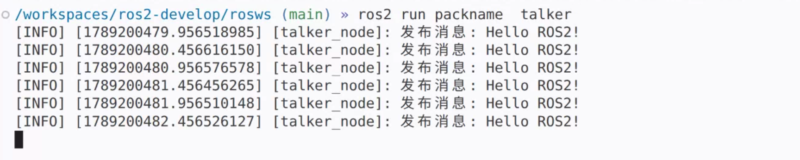
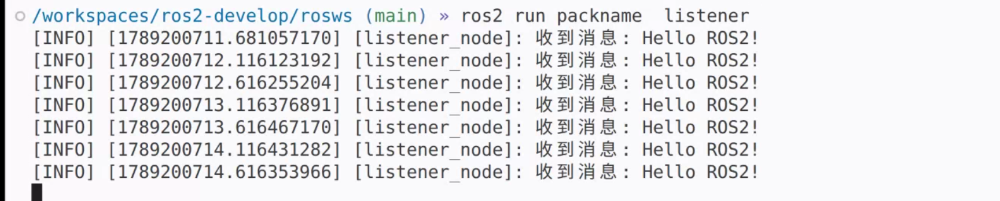

## &#x20;第一周算法任务完成情况如下：
### &#x09;任务1：在ros2开发环境下完成一份简单的消息发布与订阅。
#### &#x09;&emsp;&emsp;&emsp;完成情况：已经成功编写一个简单的ros2包并在这个包底下放两个可以分别执行的节点（发布与订阅的节点）,下面为发布和订阅的运行示例(图片一定可以加载出来等一会就可以了):  

&emsp;&emsp;（不过此处有一个小疑问，为什么在install set_up.bash的时候会一直显示not_found?AI说在jazzy版本中的逻辑与foxy的不一致，但我是个小灯并不知道这个说法的可靠性，虽然最终解决了，不过还是想请教一下。  

####  &#x09;   任务二的具体如下：https://github.com/Very612/Very-
### &#x09;任务2：- 查阅相关资料，使用 C++ 做一套处理管线，将输入的二值图像矩阵使用 5x5 结构元素进行膨胀。
#### &#x09;&emsp;&emsp;&emsp;完成情况：已经实现所述的基础膨胀和腐蚀功能，同时实现边角圆润化，并且还增加了多局测验，单局内的多次膨胀与腐蚀，以及比较简陋的可视化,在了解了openCV之后感觉两张图片不叠放效果不明显，所以采取了较为简陋的方式。现讲述思路：  
#### &#x09; &emsp;&emsp; 本代码用动态二维数组vector来存放0，1二值矩阵和结构元素，矩阵遇到‘1’将坐标存起来，结构元素的话将该坐标值与中心点的差值存起来，之后先遍历矩阵的‘1’，后遍历结构元素的方向，来实现腐蚀与膨胀，边角圆润化将结构元素的边角设置成‘0’即可，可视化阶段将‘1’视为黑色方块，‘0’视为白色方块，输出的时候进行转换再用覆盖字符盖住之前的输出并用sleep来延迟下一次的输出来达到变换的效果，若想替换其中的任意元素只需输出break退出此次进程输入N之后进入下一次的调试即可。
#### &#x09; 运行结果如下：

https://github.com/user-attachments/assets/d1879496-759d-483c-82bd-99ce8668b321

